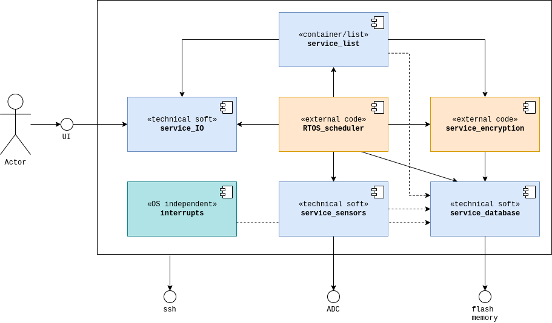

# Building Block View {#section-building-block-view}

## Whitebox Overall System {#_whitebox_overall_system}

**Inputs of building block view:**
 - use of a Raspberry Pico board with double core
 - use of gdb as debugger
 - Split firmware into services and tasks

Those are the main items of our project. For more details, see all decisions, requirements, context and goals made in previous step of ARC42 process, (steps 01 to 04)

With those directions, we may provide a first diagram about the highest level of architecture


<div align="center"> architecture - building block level 1
<div align="left">

**Logical decomposition**

On the architecture overview, we split the system depending on their functional goals. The second decision was to split components which uses external code/library/framework (like the RTOS scheduler/core) from those we fully develop ourselves.

The annotation on each component (as well as the color) helps understand the decomposition.

**Contained building blocks:**

| Building block | Description |
|:-|:-|
|```RTOS_scheduler```| Real time os task and service scheduler |
|```service_list```| Container for all application software services  |
|```service_IO```| All *embedded* communication mean available during run-time |
|```service_encryption```| External library to do encryption |
|```service_database```| Manage non volatile and volatile big memory blocks |
|```service_sensors```| Everything which comes from the physical world |
|```interrupts```| Particular block, container which gathers interrupt handling |

**Important Interfaces**

| Interface | Description |
|:-|:-|
|```UI```| **U**ser **I**nterface,  interface between user system |
|```ssh```| **S**uper **SH**ell, used for debug, analysis and continuous integration |
|```ADC```| **A**nalog to **D**igital **C**onverter, interface to physical world |
|```flash memory```| Interface to file system |

## Building block description

### ```RTOS_scheduler```
**Purpose/Responsibility:**  
Real Time OS core and scheduler, here will be defined our RTOS behavior, which task/services call and so on. Every RTOS behavior relevant decision/development will be done here

**Interface(s)**  
All services in our program, except for interrupts block which is independent

**(Optional) Quality/Performance Characteristics**  
Quality goals are listed in [goals of RTOS](../00_Requirements_Inputs/01_introduction_and_goals_RTOS.md). There is a list of quality goals to reach, each one of them being good or bad. We will explore here the differences of quality between a well tailored RTOS from a quick and dirty RTOS massacre.

**(Optional) Directory/File Location>**  
@todo

**(Optional) Fulfilled Requirements**  
From file [goals](../00_Requirements_Inputs/01_introduction_and_goals_RTOS.md), fulfill requirement R1.3

**(optional) Open Issues/Problems/Risks**  
@todo

### ```service_list```
**Purpose/Responsibility:**  
Gather all application software we want to develop. It is a list, as application software need to be decomposed in services. Each app software topic in its own service

**Interface(s)**  
@todo

**(Optional) Quality/Performance Characteristics**  
@todo

**(Optional) Directory/File Location>**  
@todo

**(Optional) Fulfilled Requirements**  
@todo

**(optional) Open Issues/Problems/Risks**  
@todo

### ```<service_IO>```
**Purpose/Responsibility:**  
 All input/output which are not for continuous integration or debug will be in this one service. But each communication will have its own task. It is described as one service for logical reason: all same purpose stuff in one container.

**Interface(s)**  
@todo

**(Optional) Quality/Performance Characteristics**  
@todo

**(Optional) Directory/File Location>**  
@todo

**(Optional) Fulfilled Requirements**  
@todo

**(optional) Open Issues/Problems/Risks**  
@todo

### ```service_encryption```
**Purpose/Responsibility:**  
A heavy computing service which uses a still to be defined external library. The library may be dynamically loaded while running or statically linked during compile phase. Its main purpose is to encrypt and decrypt data, while using a lot of CPU time and some shared resources.

**Interface(s)**  
@todo

**(Optional) Quality/Performance Characteristics**  
@todo

**(Optional) Directory/File Location>**  
@todo

**(Optional) Fulfilled Requirements**  
@todo

**(optional) Open Issues/Problems/Risks**  
@todo

### ```service_database```
**Purpose/Responsibility:**  
Takes care of memory management. It is either volatile or non volatile, a file system or simple  C malloc() or whatever but it takes care to save data on memory for the system. It is a *critical* shared resource.

**Interface(s)**  
@todo

**(Optional) Quality/Performance Characteristics**  
@todo

**(Optional) Directory/File Location>**  
@todo

**(Optional) Fulfilled Requirements**  
@todo

**(optional) Open Issues/Problems/Risks**  
@todo

### ```service_sensors```
**Purpose/Responsibility:**  
Provide values and events coming from the physical world. It is a kind of interaction with the system. Like ```service_IO``` each sensor should have its own task. The described service here is more like a container

**Interface(s)**  
@todo

**(Optional) Quality/Performance Characteristics**  
@todo

**(Optional) Directory/File Location>**  
@todo

**(Optional) Fulfilled Requirements**  
@todo

**(optional) Open Issues/Problems/Risks**  
@todo

### ```interrupts```
**Purpose/Responsibility:**  
Container which gathers all interrupt behavior, it is RTOS independent and may preempt full system as its priority is most of the time maximal (except for task of fatal level)

## Interfaces description

### ```UI```
**U**ser **I**nterface, is the logical interface between user (may be human or another system) and our system. It is an embedded communication mean like CAN, I2C or USART. It may be used by all of the application software services (component ```service_list```)

### ```ssh```
**S**uper **SH**ell, used for debug, analysis and continuous integration. It touches the whole system and will allow us to do some deep performances analysis.

### ```ADC```
**A**nalog to **D**igital **C**onverter, is our interface to physical world. It may be stubbed or not really exists, its main purpose is to watch something moving and have fun.

### ```flash memory```
Is the interface to our file system. Depending on our hardware target, it may be the interface to a flash storage or a full file system on a hard drive like an SSD.


See [Building Block View](https://docs.arc42.org/section-5/) in the
arc42 documentation.
